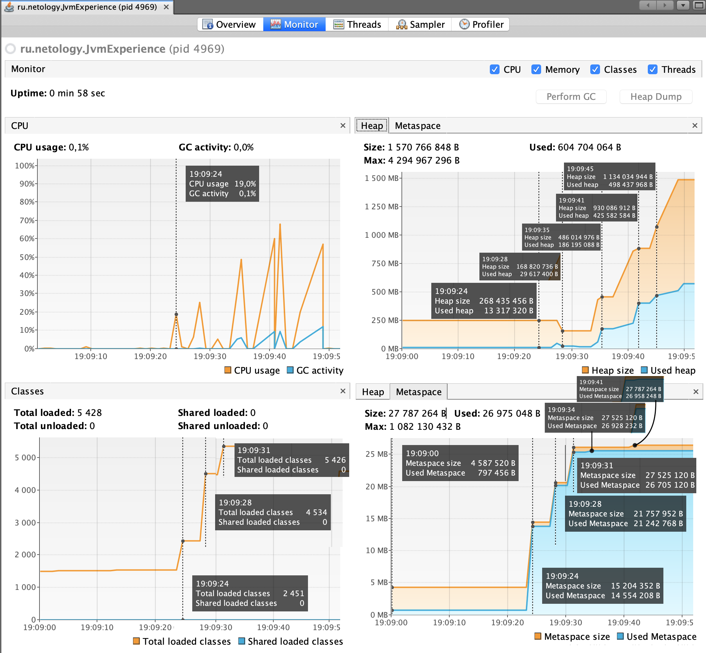

# Задача "Понимание JVM"

## Описание
Просмотрите код ниже и опишите (текстово или с картинками) каждую строку с точки зрения происходящего в JVM  

Не забудьте упомянуть про: 
- ClassLoader'ы, 
- области памяти (стэк (и его фреймы), хип, метаспейс)  
- сборщик мусора

## Код для исследования
```java

public class JvmComprehension {

    public static void main(String[] args) {
        int i = 1;                      // 1
        Object o = new Object();        // 2
        Integer ii = 2;                 // 3
        printAll(o, i, ii);             // 4
        System.out.println("finished"); // 7
    }

    private static void printAll(Object o, int i, Integer ii) {
        Integer uselessVar = 700;                   // 5
        System.out.println(o.toString() + i + ii);  // 6
    }
}

```

## Выполнение

При запуске программы сначала происходит подгрузка классов посредством ClassLoader. В нашем случае подгружаются: JvmComprehension, String, Object, Integer, System. При этом String, Object, Integer, System - являются частью JDK и подгружаются в первую очередь.
Далее происходит Связавыние Linking, а именно:
 - Verify проверка валидности и синтаксической консистентности
 - Prepare подготовка примитивов в статических классах (в данном случае проходит без реальной проверки)
 - Resolve разрешение символьных ссылок (в данном случае также опускается)
Следующим этапом является Inititalization - выполняются инициализаторы static полей и методов - т.е. printAll и main.

Данные, которые были получены посредством предыдущего этапа попадают Metaspace, Stack Memory и Heap.
При выполения метода main создается новая область фрейм в Stack Memory (SM). 
На пункте 1 в данную область записывается примитив int i = 1. 
На пункте 2 в Heap создается создается новый объект класса Object, который записывается в кучу Heap, а ссылка o - в SM. 
На пункте 3 также происходит создание объекта в Heap, а ссылка сохраняется в SM. 
На пукнте 4 происходит создание фрейма в SM для функции printAll и далее начинается его заполнение.
На пункте 5, аналогично пункту 3 происходит создание объекта Integer в Heap и сохраняется ссылка uselessVar в SM. 
На пункте 6 создается новый фрейм в SM под вызов println. Перед этим будет создана строчка в String Pool - части области памяти Heap, ссылка на которую будет передана в созданный фрейм.
В пункте 6 также будет создан новый фрейм в SM под вызов. Также, как и в пункте 6 будет создана строчка в String Pool и ссылка на нее будет передана в созданный фрейм.


# Задача "Исследование JVM через VisualVM"

## Описание
Предлагаем вам изучить использование памяти через VisualVM при загрузке новых классов и создании новых объектов

## Выполнение

#### Результат вывода в консоль [программы](https://github.com/Arsennikum/jvm-visualvm-experience)
```
19:08:52: Executing task 'JvmExperience.main()'...

> Task :compileJava UP-TO-DATE
> Task :processResources NO-SOURCE
> Task :classes UP-TO-DATE

> Task :JvmExperience.main()
Please open 'ru.netology.JvmExperience' in VisualVm
19:09:23.719: loading io.vertx
19:09:24.130: loaded 529 classes
19:09:27.135: loading io.netty
19:09:27.795: loaded 2117 classes
19:09:30.800: loading org.springframework
19:09:31.002: loaded 869 classes
19:09:34.006: now see heap
19:09:34.006: creating 5000000 objects
19:09:34.998: created
19:09:38: creating 5000000 objects
19:09:41.651: created
19:09:44.667: creating 5000000 objects
19:09:45.139: created

BUILD SUCCESSFUL in 59s
2 actionable tasks: 1 executed, 1 up-to-date
19:09:52: Task execution finished 'JvmExperience.main()'.
```
#### Результат мониторинга посредством VisualVM



По итогу контрольных точек вышло:
24 секунда - io.vertx - загружено 529 классов, Значительно увеличился Metaspace для хранения объектов этих классов. 
28 секунда - io.netty - загружено 2117 классов. Очевидно вырос Metaspace. Но при этом снизился Heap - сработал Garbage Collector на неиспользуемый объекты.
31-34 секунда - org.springframework - загружено 869 классов. Также очевидно продолжил рости Metaspace. Также значительно увеличился Heap за счет создания экземпляров классов.
35 секунда - создание 5000000 объектов первый раз - количество загруженных классов почти не изменилось. Стоит заметить, что Metaspace немного увеличился - был подгружен 1 класс. Heap значительно вырос из-за создания большого количества объектов.
41 секунда - создание 5000000 объектов второй раз - аналогично 35 секунде был загружен 1 класс. Metaspace также незначительно вырос. Heap также вырос. 
45 секунда - создание 5000000 объектов третий раз - аналогично предыдущим 2ум - был также загружен 1 класс, Metaspace также вырос - при том как использованное место, так и зарезервированное. Heap очевидно растет. 

